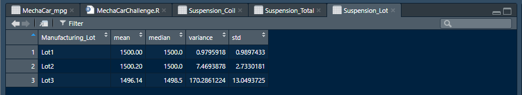

# MechaCar Statistical Analysis

## R Programming Language
In Module Fifteen, R programming language, a language popular in data science and academia due to its statistical modeling and hypothesis testing, is introduced.  Similar to Python, the R analysis scripts, also known as RScripts, are written in plaintext which makes it easy to control in Git.

## Linear Regression to Predict MPG

Based on the Linear Regression Model for the MechaCar Statistical Analysis, it has been determined that vehicle_length and ground_clearance impact the mpg the most of all the coefficients.  The slope of the MechaCar Linear Regression Model is not zero because R-squared is 71%.  Because R-squared is 71%, this MechaCar Linear Regression Model is able to predict mpg of MechaCar prototypes effectively since the 71% is closest to 100% and is considered to be a reliable test.

## Summary Statistics on Suspension Coils

Based on the analysis of the suspension coils summarization grouped by Manufacturing Lot, it is determined that Lot3 does not meet the design specifications for all manufacturing lots.  The mean of Lot3 is below the expected mean of 1500 at a mean value of 1496.14 and the variance exceeds 100 at a rate of 170.2861224.

## T-Tests on Suspension Coils

After performing the T-Tests on the MechaCar data, it is determined that the T-Test performed on Lot3 provides the most useful feedback because the p-value is at .04168 which is below the statistically significant value of .05.

## Study Design: MechaCar vs Competition

In conclusion, it has been determined that vehicle_length and ground_clearance would be of interest to a consumer in terms of effects on mpg. Based on the statistical tests performed on the MechaCar data, there would be varying results when comparing to competitor data.  For example, in cases of more favorable competitors than MechaCar, when applying similar t-tests to the competitor data, the t-value for Lot3 would be much closer to zero with the p-value at or below .05.

