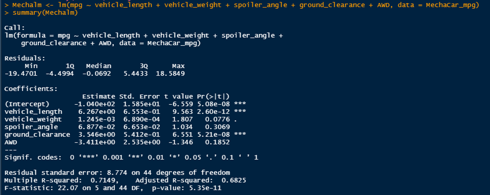

# MechaCar Statistical Analysis

## R Programming Language
In Module Fifteen, R programming language, a language popular in data science and academia due to its statistical modeling and hypothesis testing, is introduced.  Similar to Python, the R analysis scripts, also known as RScripts, are written in plaintext which makes it easy to control in Git.

## Linear Regression to Predict MPG

Based on the Linear Regression Model for the MechaCar Statistical Analysis, it has been determined that vehicle_length and ground_clearance impact the mpg the most of all the coefficients.  The slope of the MechaCar Linear Regression Model is not zero because the $R^2$ is 71%

